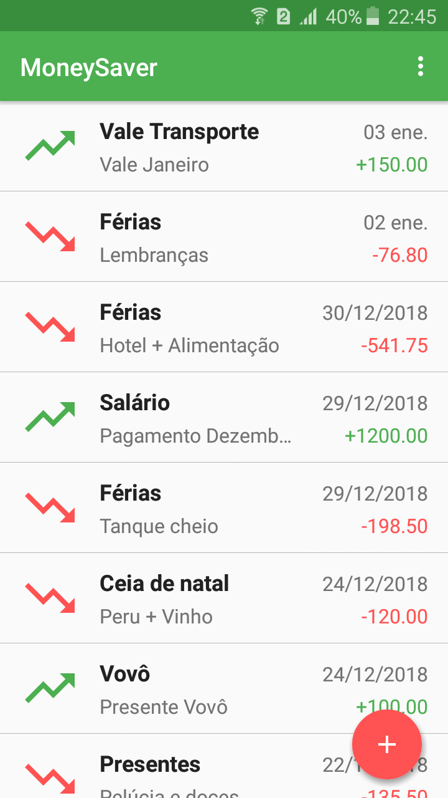

# MoneySaver

Android app to track daily expenses and incomes, you can check how much you spent/got and have a graphical representation of it with a pie chart.


## Getting Started
Clone this repository and import into **Android Studio**
```bash
git clone https://github.com/Trowsing/MoneySaver.git
```
You can also use the "gradlew build" command or use "Import Project" in Android Studio.

Screenshots
-------------

 


## Build variants
Use the Android Studio *Build Variants* button to choose between **production** and **staging** flavors combined with debug and release build types


## Generating signed APK
From Android Studio:
1. ***Build*** menu
2. ***Generate Signed APK...***
3. Fill in the keystore information *(you only need to do this once manually and then let Android Studio remember it)*

## Maintainers
This project is mantained by:
* [Jhonathan Ballesteros](http://github.com/Trowsing)


## Contributing

1. Fork it
2. Create your feature branch (git checkout -b my-new-feature)
3. Commit your changes (git commit -m 'Add some feature')
4. Push your branch (git push origin my-new-feature)
5. Create a new Pull Request
